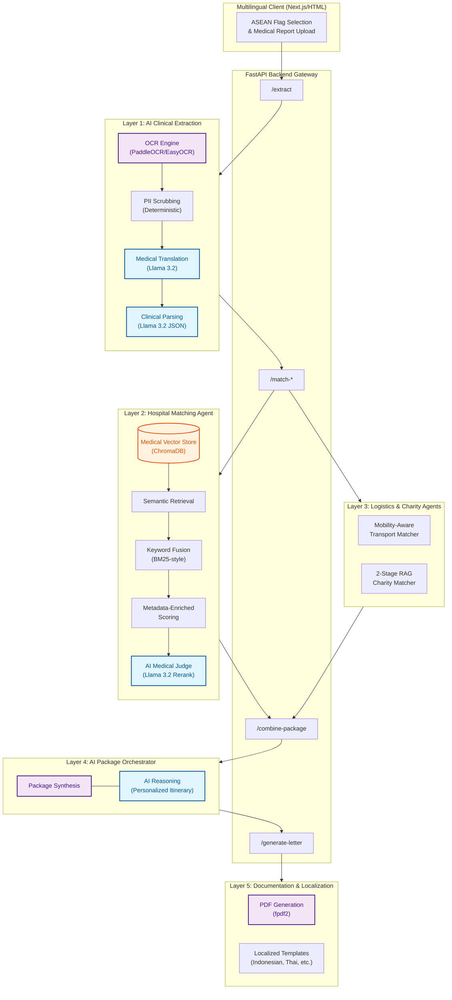

# ASEAN Medical Match

ASEAN Medical Match is a multi-agent medical travel matching platform for patients seeking treatment in Malaysia. It combines clinical extraction, hospital matching, flight planning, charity matching, and visa-support document generation in one workflow.

## What is new

- Country-first onboarding with ASEAN flag selection
- Simpler UI focused on one guided patient flow
- Localized interface based on the selected country
- Translated recommendation text and translated PDF support letters
- Structured MHTC / Borang IM.47 visa support letters with placeholder-only PII
- Clinical extraction that now explicitly tracks age group and urgency

## User flow

1. Open the app at `/tester`
2. Choose an ASEAN country from the flag list
3. The app switches to that country's language for the UI
4. Upload a medical report image or PDF
5. Review extracted clinical fields:
   - Age Group
   - Diagnosis
   - Urgency Status
6. Select one hospital, one flight, and one charity
7. Generate the final itinerary and download support letters

## Current letter behavior

The visa-support flow is deterministic and formatted for `fpdf2` `multi_cell(...)` usage.

- The letter includes:
  - clinical extraction summary
  - selected hospital
  - selected flight
  - selected charity
  - MHTC and Borang IM.47 references
- Personal identifiers are never injected into the visa-support content
- PII fields are emitted as literal blanks:
  - `PATIENT NAME: ___________________________`
  - `PASSPORT NUMBER: _______________________`
  - `CAREGIVER NAME: _________________________`
- If the case is `Critical`, the tone changes to a medical appeal
- Otherwise, it stays a medical travel support letter

## Architecture



### AI Integration Details

ASEAN Medical Match utilizes a multi-agent AI architecture powered by **Llama 3.2** (via Ollama) and **ChromaDB**:

*   **AI Clinical Extraction**: Uses LLMs to translate diverse ASEAN medical reports into English and extract structured clinical parameters (Condition, Severity, Urgency) while maintaining PII safety.
*   **AI Medical Judge**: A specialized Rerank Agent that acts as a clinical coordinator, comparing the top 5 semantic hospital matches and re-ordering them based on sub-specialty alignment and hospital tiering.
*   **AI Package Orchestration**: Synthesizes disparate data (Medical, Logistics, Charity) into a cohesive travel itinerary with AI-generated reasoning that explains the value proposition to the patient.
*   **Dynamic Localization**: Real-time translation of both the user interface and generated PDF support letters, ensuring patients receive guidance in their native language.

### Layer 1: Clinical extraction

- OCR extracts raw chart text
- The chart is translated to English for internal parsing
- The parser extracts:
  - condition
  - sub-specialty inference
  - severity
  - age group
  - urgency

### Layer 2: Hospital matching

- ChromaDB semantic retrieval plus keyword fusion
- Specialty-group filtering
- Metadata-aware ranking
- LLM reranking for final specialist recommendations

### Layer 3: Flight and logistics matching

- Mobility-aware transport recommendations
- Commercial flight suggestions for standard cases
- Charter escalation path for stretcher cases

### Layer 4: Charity matching

- Two-stage RAG matching
- Country-priority and ASEAN regional logic
- Focused support for oncology and cardiology use cases

### Layer 5: Documentation

- PDF generation with `fpdf2`
- Country-selected translation for user-facing letters
- Placeholder-safe translation preserving blank PII lines

## Multilingual behavior

The selected country drives:

- interface language
- dynamic recommendation translation
- generated support-letter language

Current frontend language mappings include:

- Brunei -> Malay
- Cambodia -> Khmer
- Indonesia -> Indonesian
- Laos -> Lao
- Malaysia -> Malay
- Myanmar -> Burmese
- Philippines -> Filipino
- Singapore -> English
- Thailand -> Thai
- Vietnam -> Vietnamese

## Key routes

- `GET /` - health check
- `GET /tester` - main user interface
- `POST /api/v1/extract` - OCR, translation, structured clinical extraction
- `POST /api/v1/match-hospitals` - hospital / specialist matches
- `POST /api/v1/match-flights` - flight and transport options
- `POST /api/v1/match-charities` - charity matches
- `POST /api/v1/combine-package` - final package reasoning
- `POST /api/v1/generate-letter` - PDF letter generation
- `POST /api/v1/translate-template` - template translation
- `POST /api/v1/translate-text` - general UI / recommendation translation

## Project structure

- `app.py` - FastAPI entrypoint and API routes
- `agents/` - hospital, flight, charity, logistics, and orchestration logic
- `utils/` - OCR helpers, parser, translator, letter generator
- `frontend/pipeline_tester.html` - country-first multilingual UI served at `/tester`
- `tests/pipeline_tester.html` - mirrored UI file for local reference
- `pipeline/` - ingestion and report-generation scripts
- `data/` - ChromaDB storage

## Run locally with Docker

```powershell
docker-compose up --build
```

Then open:

- [http://localhost:8000/tester](http://localhost:8000/tester)

## Notes

- The backend translates uploaded charts into English for internal extraction, even when the user-facing UI is localized.
- The served UI now lives in `frontend/` so Docker includes it reliably.
- Charity matching currently targets oncology and cardiology support paths.

## Build context

Built for ASEAN medical-travel coordination and hackathon-style rapid matching workflows.
