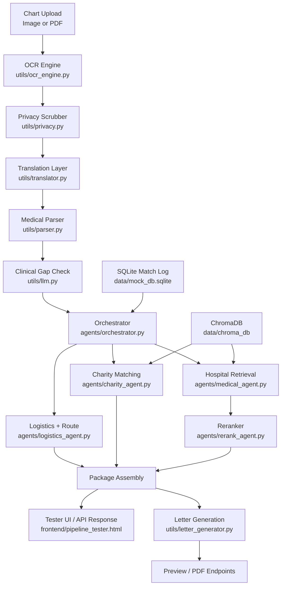

# ASEAN Medical Match

ASEAN Medical Match is a FastAPI-based medical travel matching system for patients seeking treatment in Malaysia. It combines OCR, privacy scrubbing, clinical structuring, hospital retrieval, logistics planning, charity matching, and support-letter generation in one pipeline.

## What It Does

- extracts text from chart images or PDFs
- scrubs sensitive patient information before LLM use
- structures messy chart text into medical case data
- matches hospitals and specialists from a local ChromaDB store
- estimates transport, travel dates, and financial support
- generates itinerary summaries and printable support letters

## Current Structure

```text
ai_medical_matching/
|-- app.py
|-- agents/
|   |-- charity_agent.py
|   |-- document_agent.py
|   |-- flight_agent.py
|   |-- logistics_agent.py
|   |-- medical_agent.py
|   |-- orchestrator.py
|   `-- rerank_agent.py
|-- data/
|   |-- chroma_db/
|   |-- mock_db.sqlite
|   `-- mock_vietnam_nguyen_van_a.txt
|-- frontend/
|   `-- pipeline_tester.html
|-- model_cache/
|-- pipeline/
|   |-- generate_charity_dashboard.py
|   |-- generate_report.py
|   |-- ingest_charities.py
|   |-- ingest_doctors.py
|   `-- ingest_mock_data.py
|-- reports/
|   |-- charity_dashboard.html
|   `-- db_dashboard.html
|-- tests/
|   |-- dev_tools/
|   |-- fixtures/
|   `-- test_pipeline.py
|-- utils/
|   |-- currency.py
|   |-- date_calculator.py
|   |-- db.py
|   |-- estimation.py
|   |-- letter_generator.py
|   |-- llm.py
|   |-- medical_specialty.py
|   |-- ocr_engine.py
|   |-- parser.py
|   |-- privacy.py
|   |-- schemas.py
|   |-- translator.py
|   `-- poppler-25.12.0/
|-- docker-compose.yml
|-- Dockerfile
`-- requirements.txt
```

## Architecture



## Request Flow

1. `POST /api/v1/extract`
   OCRs the uploaded chart, scrubs PII, translates the text, and returns structured medical data.
2. `POST /api/v1/match-packages`
   Builds ranked packages from hospital retrieval, route simulation, grant estimates, and budget rules.
3. `POST /api/v1/preview-letter` or `POST /api/v1/generate-letter`
   Produces support-letter previews or PDFs from the selected package.

## Main API Endpoints

| Method | Endpoint | Purpose |
| --- | --- | --- |
| `GET` | `/` | Health check |
| `GET` | `/tester` | Interactive browser tester |
| `POST` | `/api/v1/extract` | OCR -> scrub -> translate -> parse |
| `POST` | `/api/v1/match-packages` | Full orchestration |
| `POST` | `/api/v1/match-hospitals` | Hospital retrieval only |
| `POST` | `/api/v1/match-flights` | Route and logistics only |
| `POST` | `/api/v1/match-charities` | Charity retrieval only |
| `POST` | `/api/v1/combine-package` | Build one final package from chosen pieces |
| `POST` | `/api/v1/preview-letter` | Letter preview |
| `POST` | `/api/v1/generate-letter` | PDF generation |
| `POST` | `/api/v1/translate-template` | Template translation |
| `POST` | `/api/v1/translate-text` | Display-text translation |
| `POST` | `/api/v1/full-pipeline` | One-shot upload-to-package flow |

## Local Setup

### Requirements

- Python 3.10+
- Tesseract OCR
- Poppler for PDF conversion
- optional Gemini API key

### Install

```bash
pip install -r requirements.txt
```

### Environment

Create `.env`:

```env
GEMINI_API_KEY=your_key_here
GEMINI_TRANSLATION_MODEL=gemini-2.5-flash-lite
GEMINI_PARSER_MODEL=gemini-2.5-flash
GEMINI_REASONING_MODEL=gemini-2.5-flash
TESSERACT_PATH=C:\Program Files\Tesseract-OCR\tesseract.exe
POPPLER_PATH=C:\poppler\bin
SERPAPI_KEY=optional
CURRENCY_FREAKS_API_KEY=optional
GLOBALGIVING_API_KEY=optional
```

### Seed Data

Recommended for local testing:

```bash
python pipeline/ingest_mock_data.py
```

Optional refresh jobs:

```bash
python pipeline/ingest_doctors.py
python pipeline/ingest_charities.py
```

### Run

```bash
uvicorn app:app --host 0.0.0.0 --port 8000 --reload
```

Open the tester at [http://localhost:8000/tester](http://localhost:8000/tester).

## Tests and Debugging

Main test:

```bash
python -m pytest tests/test_pipeline.py -v
```

Useful helper scripts:

```bash
python tests/dev_tools/check_db.py
python tests/dev_tools/check_charity_conditions.py
python tests/dev_tools/test_connections.py
python tests/dev_tools/test_ocr_full.py
python tests/dev_tools/test_vietnamese_parsing.py
python tests/dev_tools/test_api.py
```

## Cleanup Notes

- cache folders like `__pycache__/` and `.pytest_cache/` are not part of the project structure
- duplicate tester and nested fixture copies were removed
- runtime stores under `data/` are intentionally kept because the app depends on them
