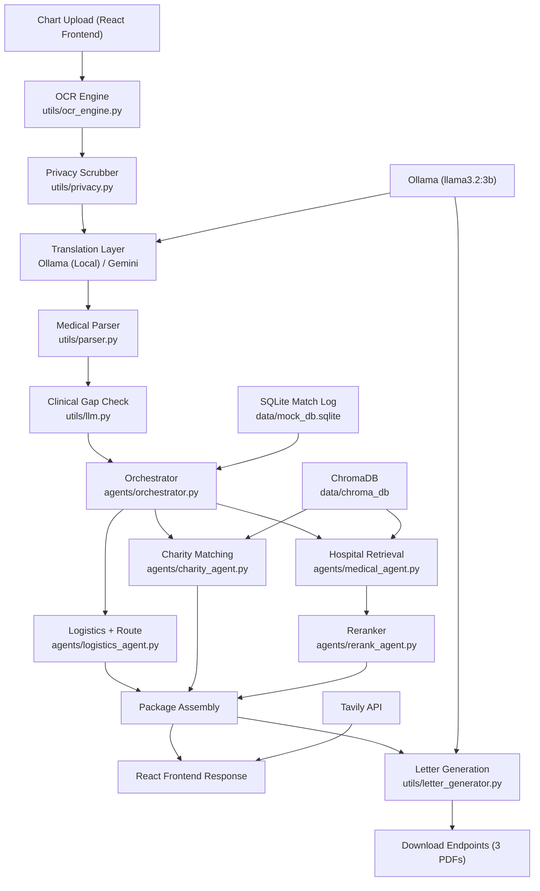

# ASEAN Medical Match

ASEAN Medical Match is a cutting-edge, agentic AI platform designed for the ASEAN AI Hackathon. It streamlines the medical tourism process for international patients seeking treatment in Malaysia. By combining document AI, local privacy-first translation, multi-agent orchestration, and localized logistics planning, it transforms messy clinical charts into actionable, personalized medical travel packages.

## What It Does

- **Document Ingestion**: Extracts text from medical chart images or PDFs using OCR.
- **Privacy First**: Scrubs Personally Identifiable Information (PII) before any cloud LLM processing.
- **Local AI Translation**: Uses local Ollama models to translate medical text and provide empathetic reasoning, bypassing rigid cloud safety filters and ensuring privacy.
- **Clinical Structuring**: Parses raw chart text into structured JSON data.
- **Intelligent Orchestration**: Detects clinical gaps and routes data through independent Medical, Logistics, and Charity agents.
- **RAG-based Matching**: Matches hospitals, specialists, and financial aid from a local ChromaDB vector store.
- **Logistics Simulation**: Estimates flights and ground transport requirements based on the patient's mobility level.
- **Document Generation**: Automatically generates customized, translated PDF support documents (Visa Letters, Hospital Referrals, and Travel Guidelines).

## Project Layout

```text
ai_medical_matching/
|-- app.py                          FastAPI entrypoint and API routes
|-- agents/                         Independent agents (Medical, Logistics, Charity, etc.)
|-- data/                           Runtime stores (ChromaDB, SQLite mock DB)
|-- frontend/                       React (Vite) Frontend application
|-- model_cache/                    Local embedding / ONNX cache
|-- pipeline/                       Ingestion scripts (Doctors, Charities, Mock Data)
|-- reports/                        Generated HTML dashboards
|-- tests/                          Testing framework and fixtures
|-- utils/                          Shared helpers (OCR, LLM, Privacy, Letter Generation)
|-- docker-compose.yml              Docker orchestration
`-- Dockerfile                      Backend container definition
```

## Architecture



## Data Sources & Integration

This project leverages both curated local vector stores and real-time live data:
- **Hospitals & Specialists**: Sourced from accredited Malaysian hospitals recognized by the **Malaysia Healthcare Travel Council (MHTC)**, indexed in **ChromaDB** for fast semantic vector retrieval.
- **Financial Aid & Charities**: Curated list of medical NGOs and financial aid programs, queried via RAG using **ChromaDB**.
- **Doctor Profiles**: Real-time validation of doctor profiles and hospital links performed via the **Tavily Search API** to ensure users are directed to accurate, live external links.
- **Flight Options**: Sourced via simulated logistics or live search (where SerpAPI is configured) to provide realistic travel costs and durations based on patient mobility needs.

## AI Tools & Stack

To deliver a premium, highly secure, and compliant experience, the system uses a hybrid AI architecture:
- **Ollama (Llama 3.2:3b)**: Runs entirely locally to handle sensitive administrative translations and generate "humanized", empathetic explanations. This is critical as it bypasses cloud safety filters that often incorrectly block medical text, while simultaneously preserving strict patient privacy.
- **Gemini 1.5 Flash / 2.5 Flash-Lite**: Leveraged for heavy-duty, complex reasoning tasks such as clinical parsing, medical chart gap detection, and complex multi-agent orchestration.
- **ChromaDB**: Used as a high-performance vector database for Retrieval-Augmented Generation (RAG) to find the most relevant specialists and charities based on semantic similarity to the patient's condition.
- **FastAPI**: Serves as the robust, high-performance Python backend.
- **React (Vite)**: Powers the dynamic, professional light-themed wizard frontend with automated locale and origin country selection.

## Implementation Details

- **Agentic Workflow**: Instead of a simple linear prompt-response, the system uses an Orchestrator to coordinate independent "Agents" (Medical, Logistics, Charity). Each agent is responsible for a specific domain, allowing for modular and complex decision-making.
- **Privacy-First Design**: PII (Personally Identifiable Information) is scrubbed locally before any clinical data is sent to external APIs, ensuring compliance with healthcare privacy standards.
- **Human-in-the-loop (Dissatisfaction Loop)**: A unique feature allows users to reject the provided doctor options. The system maintains memory of these rejections and triggers a refined search, ensuring the user eventually finds a suitable match.


## Current Behavior Notes

- OCR text is translated through the model layer before parsing.
- Clarification answers are normalized back into structured medical fields before rerunning package matching.
- The previous appointment-letter flow is now a travel-guidance letter that explains how to contact the hospital, use the Malaysian visa portal, and complete MDAC.
- Letter translation is done through the model-backed document translation path rather than hard-coded per-language templates.
- **Memory & Regeneration**: The system maintains state for rejected hospitals. If the user regenerates and no more options are available, the system alerts the user and falls back to the previous options.
- **Navigation**: Added "Back" buttons in the UI to allow seamless transition between the medical report summary and the matched packages.

## Request Flow

1. `POST /api/v1/extract`
   OCRs the uploaded chart, scrubs PII, translates the text, and returns structured medical data.
2. `POST /api/v1/match-packages`
   Runs clarification checks, builds ranked packages from hospital retrieval, route simulation, grant estimates, and budget rules.
3. `POST /api/v1/preview-letter` or `POST /api/v1/generate-letter`
   Produces support-letter previews or PDFs from the selected package.

## Main API Endpoints

| Method | Endpoint | Purpose |
| --- | --- | --- |
| `GET` | `/` | Health check |
| `GET` | `/tester` | Interactive browser tester |
| `POST` | `/api/v1/extract` | OCR -> scrub -> translate -> parse |
| `POST` | `/api/v1/match-packages` | Full orchestration with clarification loop |
| `POST` | `/api/v1/match-hospitals` | Hospital retrieval only |
| `POST` | `/api/v1/match-flights` | Route and logistics only |
| `POST` | `/api/v1/match-charities` | Charity retrieval only |
| `POST` | `/api/v1/combine-package` | Build one final package from chosen pieces |
| `POST` | `/api/v1/preview-letter` | Letter preview |
| `POST` | `/api/v1/generate-letter` | PDF generation |
| `POST` | `/api/v1/translate-template` | Template translation |
| `POST` | `/api/v1/translate-text` | Display-text translation |
| `POST` | `/api/v1/full-pipeline` | One-shot upload-to-package flow |

## Local Setup

### Requirements

- Python 3.10+
- Tesseract OCR
- Poppler for PDF conversion on Windows
- Optional Gemini API key

### Install

```bash
pip install -r requirements.txt
```

### Environment

Create `.env`:

```env
GEMINI_API_KEY=your_key_here
GEMINI_TRANSLATION_MODEL=gemini-2.5-flash-lite
GEMINI_PARSER_MODEL=gemini-2.5-flash
GEMINI_REASONING_MODEL=gemini-2.5-flash
TESSERACT_PATH=C:\Program Files\Tesseract-OCR\tesseract.exe
POPPLER_PATH=C:\poppler\bin
SERPAPI_KEY=optional
CURRENCY_FREAKS_API_KEY=optional
GLOBALGIVING_API_KEY=optional
```

### Seed Data

Recommended for local testing:

```bash
python pipeline/ingest_mock_data.py
```

This seeds extra specialists and charities so the tester's `Regenerate` flow has alternate matches to rotate through.

Optional refresh jobs:

```bash
python pipeline/ingest_doctors.py
python pipeline/ingest_charities.py
```

### Run

```bash
uvicorn app:app --host 0.0.0.0 --port 8000 --reload
```

Open the tester at [http://localhost:8000/tester](http://localhost:8000/tester).

## Deployment

This project is Docker-ready and can be deployed to any VPS (DigitalOcean, AWS, etc.) with at least **4GB RAM** (required for Ollama).

### Steps to Deploy

1. **Clone the repository** on your server.
2. **Create a `.env` file** in the root directory and add your API keys (e.g., `GEMINI_API_KEY`).
3. **Run the application** using Docker Compose:
   ```bash
   docker-compose up -d --build
   ```
4. **Access the application**:
   - Frontend: `http://<your-server-ip>:8080`
   - Backend: `http://<your-server-ip>:8000`

The Nginx configuration in the frontend container automatically proxies API requests to the backend, so no code changes are needed for base deployment.

## Tests and Debugging

Main test:

```bash
python -m pytest tests/test_pipeline.py -v
```

Useful helper scripts:

```bash
python tests/dev_tools/check_db.py
python tests/dev_tools/check_charity_conditions.py
python tests/dev_tools/test_connections.py
python tests/dev_tools/test_ocr_full.py
python tests/dev_tools/test_vietnamese_parsing.py
python tests/dev_tools/test_api.py
```

## Repo Hygiene

- `model_cache/`, `data/chroma_db/`, and generated `reports/` are runtime artifacts, not hand-edited source files.
- `__pycache__/`, `.pytest_cache/`, and temporary OCR files can be safely deleted.
- External Windows binary folders such as local Poppler bundles should stay out of git and be referenced through `.env`.
