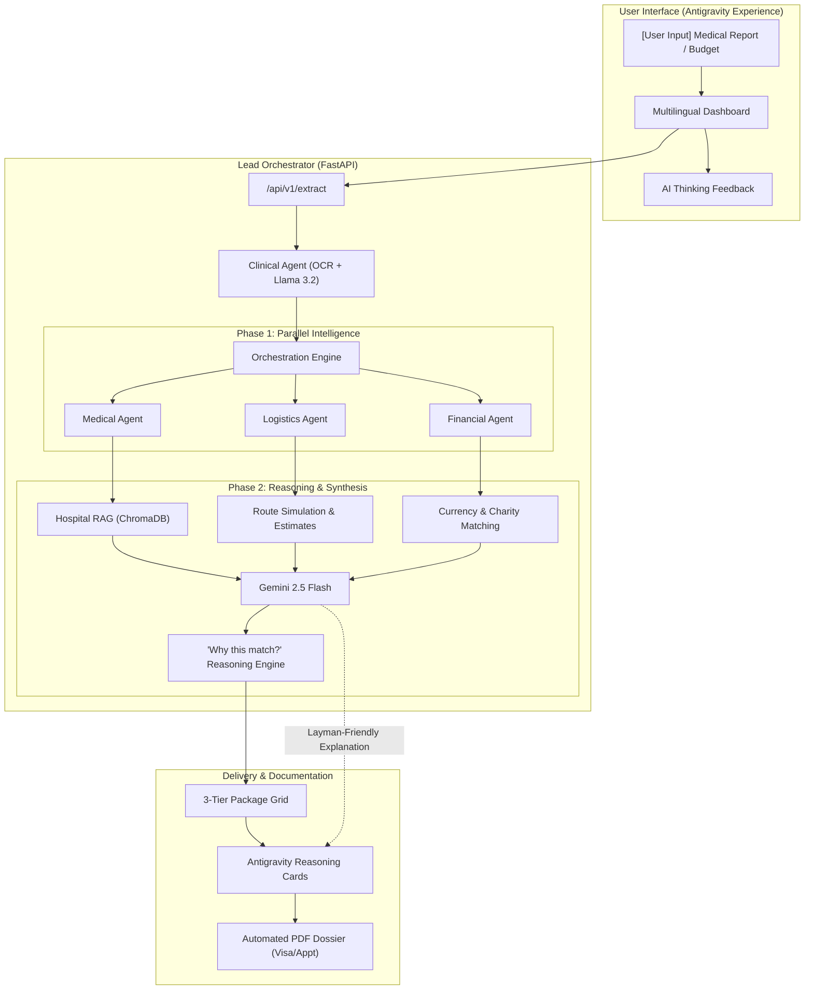

# 🇲🇾 ASEAN Medical Match: Antigravity Orchestrator Pipeline

**ASEAN Medical Match** is a high-precision, multi-agent medical tourism platform designed to transform complex clinical data into empathetic, actionable medical travel itineraries for the ASEAN region.

Powered by the **Antigravity AI Agent**, the platform provides transparent, reasoning-driven matching that bridges the gap between clinical requirements, logistical constraints, and patient financial needs.

---

## 🏗 Architecture Diagram



---

## 🚀 Key Features

### 🧠 Antigravity AI Reasoning (Gemini 2.5 Flash)
Unlike standard RAG systems that just list results, Antigravity uses **Gemini 2.5 Flash** to synthesize a "Solid Reason" for every recommendation.
- **Empathetic Explanations**: Converts clinical jargon into layman-friendly reassurance.
- **Holistic Context**: Explains why a specific hospital, flight route, and charity grant were combined for *this specific patient*.
- **Multilingual Reasoning**: Automatically translates "Why this match?" summaries into the user's local language (Indonesian, Malay, etc.).

### 🏗 3-Layer Orchestration Model
1. **The Clinical Layer**: Extracts "Ground Truth" from raw reports (Severity, Urgency, Age Group) using Tesseract and Llama 3.2.
2. **The Logistics Layer**: Simulates ASEAN-specific travel routes and matches patients with **100+ MHTC-accredited hospitals** in Malaysia.
3. **The Financial Layer**: Performs live currency conversion (CurrencyFreaks) and eligibility matching for **ASEAN Charity Funds** if a budget gap is detected.

### 📄 Automated Document Pipeline
Generates professional, submission-ready medical travel documents:
- **MHTC Visa Support Letters**: Includes clinical extraction summaries and Borang IM.47 facilitation requests.
- **Appointment Confirmations**: Direct hospital referrals with MMC registration placeholders.
- **Charity Memos**: Formal documentation of matched financial aid for hospital patient centers.

---

## 🌍 Localization & Transparency
The platform is designed for cross-border medical facilitation:
- **UI Localization**: Full support for 10+ ASEAN locales.
- **Agentic Transparency**: Visual "AI Thinking" indicators show exactly which re-ranking step the Antigravity agent is performing.
- **Manual Override Mode**: Allows users to bypass AI optimization to view raw clinical matching order from ChromaDB.

---

## ⚙️ Setup & Environment

### Prerequisites
- **Docker & Docker Compose**
- **Ollama**: Running locally for clinical extraction (Llama 3.2).
- **Gemini API Key**: For dynamic reasoning generation.

### Environment Variables (`.env`)
| Variable | Description |
| :--- | :--- |
| `GEMINI_API_KEY` | Powers the Antigravity Reasoning Engine. |
| `CURRENCY_FREAKS_API_KEY` | Real-time FX rates for ASEAN currencies. |
| `SERPAPI_KEY` | Real-time flight search (Optional). |
| `OLLAMA_BASE_URL` | Endpoint for the Llama 3.2 clinical engine. |

---

## 🐳 Running Locally

```powershell
# Build and start the pipeline
docker compose up --build
```

Access the **Antigravity Pipeline Tester** at [http://localhost:8000/tester](http://localhost:8000/tester).

---

## 🛠 Tech Stack
- **Backend**: FastAPI, Python 3.10+
- **Database**: ChromaDB (Vector Search)
- **Intelligence**: Gemini 2.5 Flash, Ollama (Llama 3.2)
- **OCR**: Tesseract OCR
- **Documentation**: fpdf2 (PDF Generation)
- **Frontend**: Vanilla HTML/JS with CSS Design Tokens
