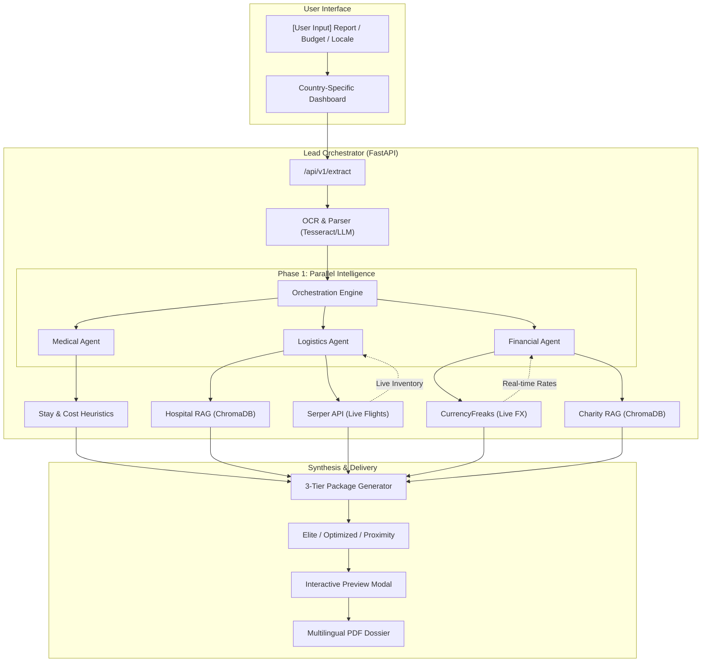

# 🇲🇾 ASEAN Medical Match: Lead Orchestrator Pipeline

ASEAN Medical Match is a high-precision, multi-agent medical tourism platform designed for the ASEAN region. It transforms raw medical charts into structured medical travel dossiers for Malaysia (MHTC).

---

## 🏗 Architecture Diagram



---

## 🏗 The 3-Layer Orchestration Model

The system follows a strict layered approach to ensure data integrity and clinical accuracy before final packages are synthesized.

### Layer 1: The Clinical Layer (Input Processing)
This layer acts as the foundation of the pipeline. It is responsible for converting unstructured data into a "Clinical Ground Truth."
- **Data Transformation**: Converts raw images or PDFs into structured JSON using **Tesseract OCR** and **Llama 3.2**.
- **Clinical Profiling**: Extracts critical patient metrics: `Age Group`, `Clinical Severity`, and `Urgency`.
- **Estimation Engine**: Utilizes keyword-based heuristics to estimate the **Total Stay Duration** (including pre-op and recovery).
- **Outcome**: A structured "Case Profile" that serves as the query input for subsequent layers.

### Layer 2: The Logistics Layer (Matching & Search)
Once the medical needs are defined, Layer 2 identifies "Where" and "How" the treatment will happen.
- **MHTC Hospital Matching**: Performs a semantic similarity search across a database of **100+ MHTC-accredited hospitals**. It filters by specialty and ranks results based on the clinical profile.
- **Live Logistics Search**: Integrates with the **Serper API** to fetch real-time flight availability and pricing from the patient's home city to Malaysia.
- **Date Calculation**: Uses a specialized utility to calculate exact arrival and departure dates based on the user's `preferred_month` and the clinical stay estimate.
- **Outcome**: A set of viable medical and travel options tailored to the patient's condition.

### Layer 3: The Financial Layer (Optimization & Bridging)
The final layer ensures the medical plan is financially viable for the user.
- **Live FX Conversion**: Connects to the **CurrencyFreaks API** to fetch real-time exchange rates, allowing users to input budgets in local currency (e.g., IDR) while calculations happen in USD.
- **Financial Gap Analysis**: Compares the total cost (Hospital + Flight) against the user's budget.
- **Charity RAG Integration**: If a financial gap is detected, this layer queries a vector store for relevant **ASEAN Charities**. It matches the patient's country and diagnosis to specific funding eligibility criteria.
- **Outcome**: A finalized budget plan with identified charity subsidies where necessary.

---

## 🧠 Agent Intelligence Deep-Dive

### 1. Clinical Agent (The Decoder)
- **OCR Engine**: Utilizes Tesseract and Pillow to extract raw text from medical reports.
- **Entity Extraction**: Uses Llama 3.2 to parse unstructured text into a JSON schema (Condition, Severity, Urgency, Age Group).
- **Heuristics Engine**: Maps conditions to `PROCEDURE_HEURISTICS` (e.g., "Knee Replacement" -> 5 days recovery, $7,500 base cost).

### 2. Logistics Agent (The Matchmaker)
- **Hospital RAG**: Queries a **ChromaDB** vector store containing 100+ MHTC-accredited hospitals. It uses semantic similarity to match the patient's condition.
- **Flight Logistics**: Connects to the **Serper API** to find real-time flights from the patient's home country to KLIA/Penang.
- **Mobility Logic**: Flags "Stretcher" vs "Wheelchair" requirements based on the severity extracted by the Clinical Agent.

### 3. Charity Agent (The Bridge)
- **Gap Analysis**: `(Estimated Procedure Cost + Flight) - User Budget = The Gap`.
- **Eligibility Matching**: Only triggers if a financial gap is detected. Queries ChromaDB for ASEAN-specific charities that match the patient's country and diagnosis.

---

## 🌍 Multilingual Support & Localization

The system is designed for local first-responders and families. It automatically handles:
- **UI Localization**: Labels, buttons, and hints in English, Indonesian, Malay, Khmer, Burmese, etc.
- **Dynamic Translation**: Uses LLM translation to convert clinical summaries while preserving medical integrity.
- **Interactive Preview**: Users can toggle between English and their local language to verify support letters before PDF generation.

---

## 📁 Data Structure & RAG

- **Vector Store**: `data/chroma_db` stores semantic embeddings for:
  - **Hospitals**: Specialty tags, MHTC accreditation status, and regional rankings.
  - **Charities**: Funding limits, covered conditions, and country eligibility.
- **Embeddings**: Utilizes `sentence-transformers` for high-precision semantic search.

---

## ⚙️ Setup & Environment

### Prerequisites
- **Docker & Docker Compose**
- **Ollama**: Running locally for LLM inference (Llama 3.2).
- **Tesseract OCR**: (Included in Docker image).

### Environment Variables (`.env`)
| Variable | Description |
| :--- | :--- |
| `CURRENCY_FREAKS_API_KEY` | Live exchange rates for 10+ ASEAN currencies. |
| `SERPAPI_KEY` | Real-time flight search via Google Flights. |
| `OLLAMA_BASE_URL` | Endpoint for the Llama 3.2 engine. |

---

## ⚙️ API Routes

- `POST /api/v1/extract`: Clinical OCR + Parse.
- `POST /api/v1/match-packages`: Orchestrates the 3-tier options (Elite, Optimized, Proximity).
- `POST /api/v1/preview-letter`: Returns HTML preview of Referral/Visa letters.
- `POST /api/v1/generate-letter`: Final PDF generation.

---

## 🐳 Running Locally

```powershell
docker compose up --build
```
Access the dashboard at [http://localhost:8000/tester](http://localhost:8000/tester).
